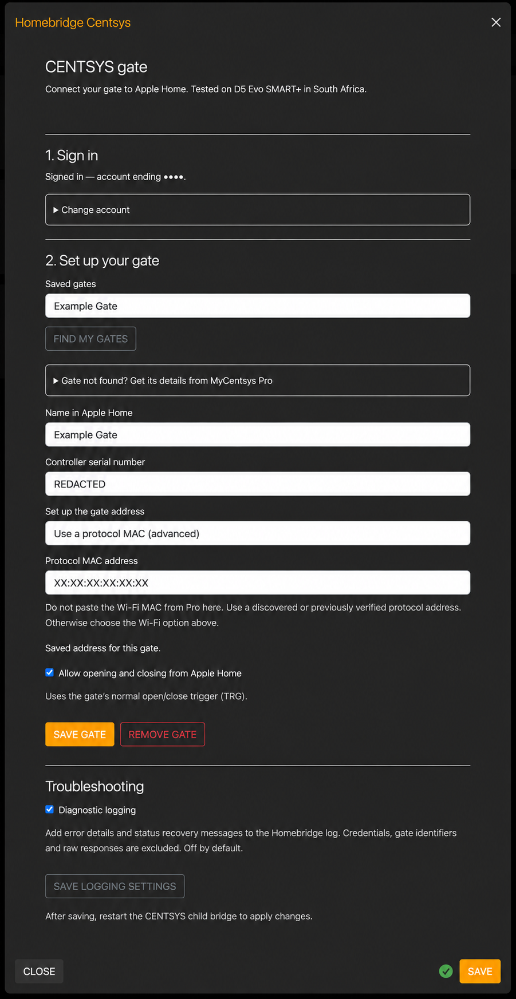

# homebridge-centsys

A Homebridge plugin for CENTURION / CENTSYS SMART+ gates, with a browser login wizard, gate-state monitoring and open/close control.



_Account and controller identifiers are replaced with example values._

Hardware validation includes one owner-confirmed physical open-and-close cycle through Apple Home on iHost. Both commands received success responses on their first attempt, and Home displayed Opening → Open → Closing → Closed. Reliability and real gate-offline testing remain in progress. Automatic account discovery is empty on this installation, so setup supports a manually supplied serial and validated protocol address. See the [changelog](CHANGELOG.md) for versioned release notes.

The tested controller is **D5 Evo SMART+**, Core and Comms Interface firmware **2.1.0.0**. Command handling is limited to this profile in South Africa. In the setup wizard, control defaults on for new gates; existing saved off settings stay off. It requires a fresh MQTT session, serializes commands and never automatically repeats an uncertain activation. One explicit configuration-version mismatch permits a corrected-version retry; this negotiation is tested in simulation and awaits hardware validation.

## Homebridge setup

Use Homebridge 2.4.x and Node 22 or 24. Install `homebridge-centsys@latest` in the npm environment used by Homebridge, then restart Homebridge, open the plugin's settings and follow the phone/OTP wizard. Select a discovered gate to fill its serial and available protocol MAC, or follow the [manual setup guide](docs/INSTALLATION.md#if-discovery-is-empty-or-the-protocol-mac-is-missing). For a D5 Evo SMART+ in South Africa, the Wi-Fi address fallback takes the serial and Wi-Fi MAC from MyCentsys Pro and fills the protocol MAC only after controller authentication and live status succeed. The helper has passed a live identity/status verification on the tested installation; discovery remains empty there. Verify the address, save and restart. Session credentials live in Homebridge's persistent storage, so restarting or updating the plugin does not require another login unless the vendor rejects the session.

See [installation, storage and control limitations](docs/INSTALLATION.md). For intermittent errors, enable **Troubleshooting → Diagnostic logging** in the plugin settings, save and restart the child bridge. This optional setting records safe failure details and recovery messages. Publishing follows the [release checklist](RELEASE_STEPS.md), with exact-version approval and npm trusted publishing.

## Development and diagnostics

```sh
npm ci
npm run check
npm pack
```

The independent research CLI remains available:

```sh
npm run prepare:auth
npm run diagnose -- login
npm run diagnose -- status
npm run diagnose -- status-known
```

`status-known` requires an owner-only `.local/auth/operator.json` containing your own controller serial. CLI credentials are separate from deployed Homebridge credentials. All diagnostic output omits identifying account/device fields and labels HTTP readings as potentially cached.

- [Diagnostic CLI guide](docs/DIAGNOSTICS.md)
- [Implementation and validation evidence](docs/VALIDATION.md)
- [Feasibility and design](docs/FEASIBILITY.md)
- [Protocol research](docs/research/connectivity.md)

Independent project, not affiliated with CENTURION, Apple or Homebridge. Adaptation credits and the upstream MIT license are in [third-party notices](THIRD_PARTY_NOTICES.md).
